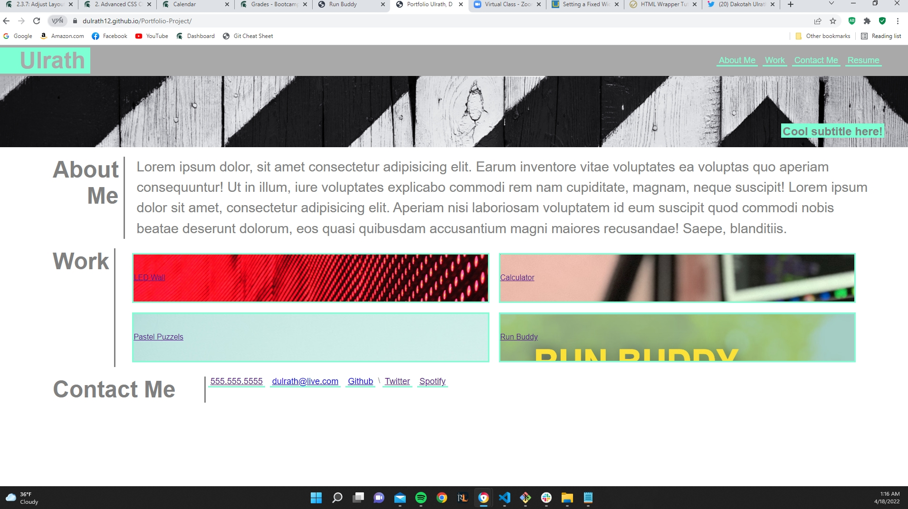

# Portfolio Project

## Description

The goal of this project was to use the HTML, and CSS knowledge we have to create a mock Portfolio website that uses and implements Flexbox. The website needed to also make use of media queries so that the website would behave differently on different sized screens and load as optimally as possible on whatever size screen was currently being used. 

** i failed to give myself enough time to get the webpage where it needed to be due to poor time management on my part, i am turning in what i currently have to hopefully get some sort of grade on it, and i plan to finish the assignment and resubmit it this week. i take full responsibility for the current, poor, state that my project is currently in. This outcome of events has shown me the importance of time management in the utmost, and has also shown me that i need to use my assets that are available to me even more. 

### Link to deployed page and repository
Page: (https://dulrath12.github.io/Portfolio-Project/)
Repo: (https://github.com/dulrath12/Portfolio-Project)
